# Gympoint

Gympoint is a multiplatform application that provides a basic management to your Gym, including a mobile application for your students to answer their questions and more.

## Screenshots

### Android Client Screenshots

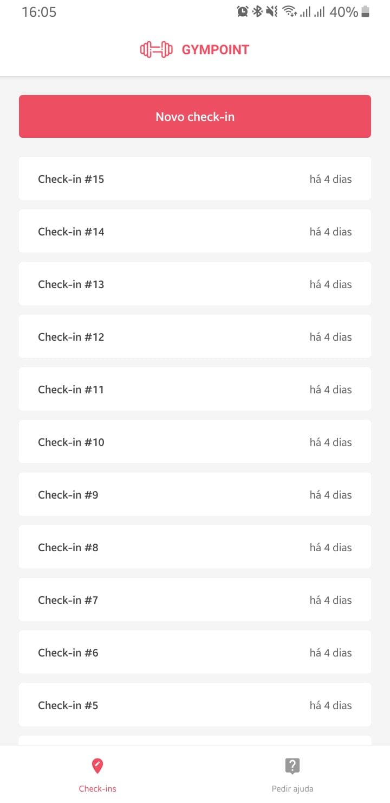 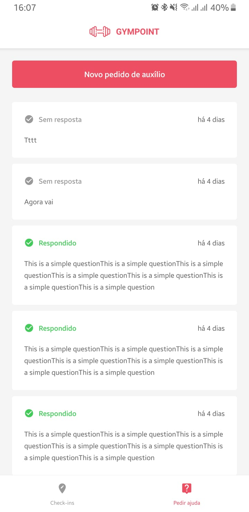 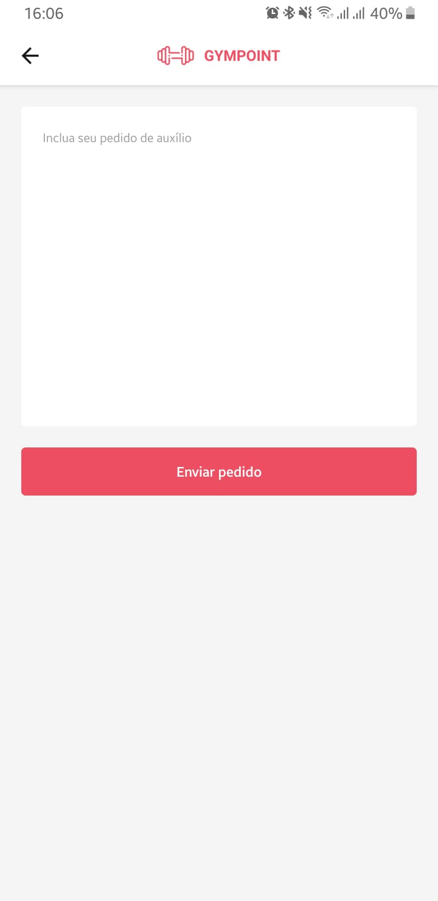 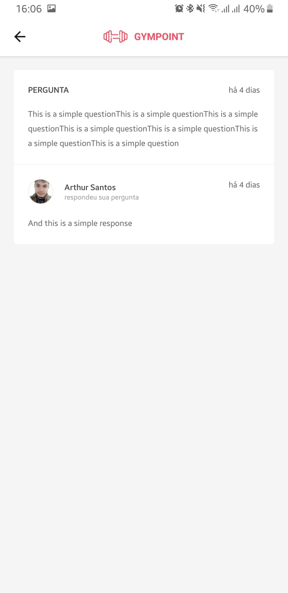

### WEB/Admin Client Screenshots

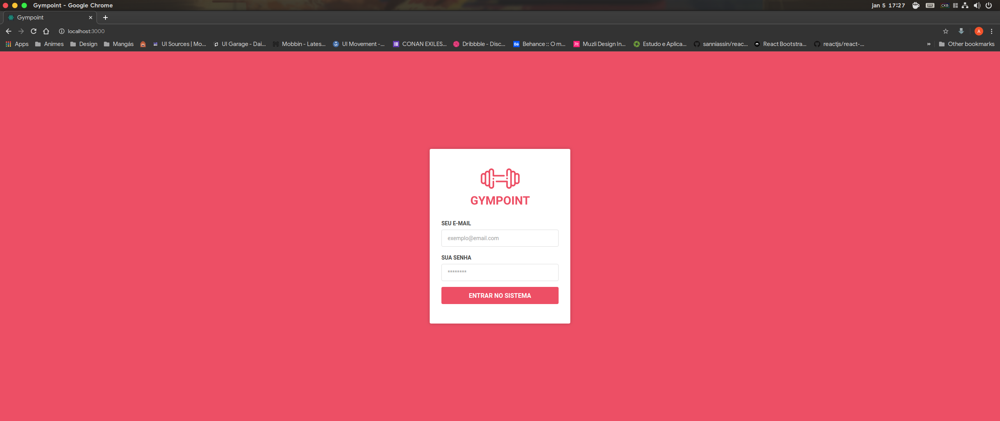

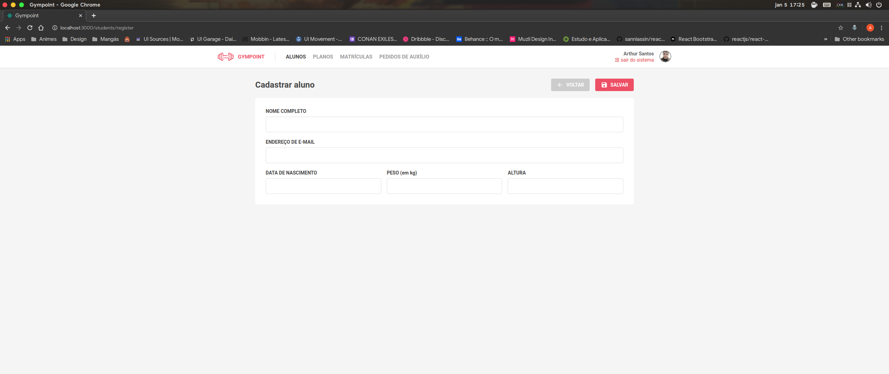
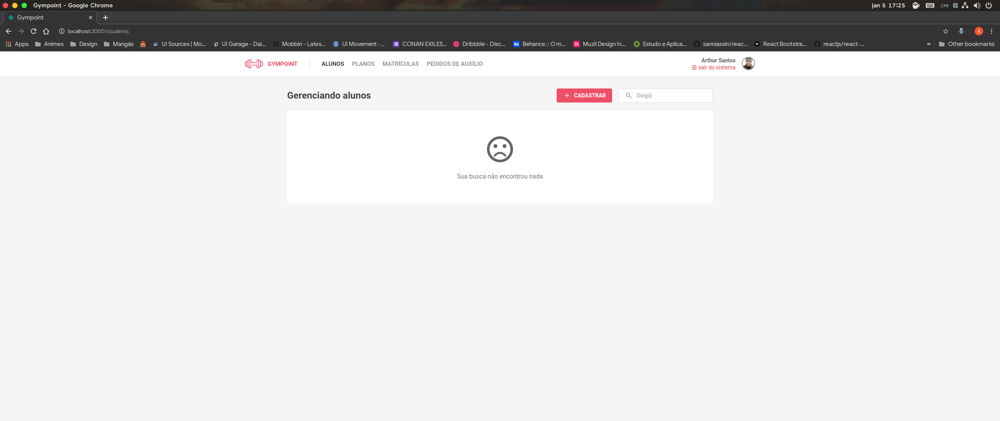
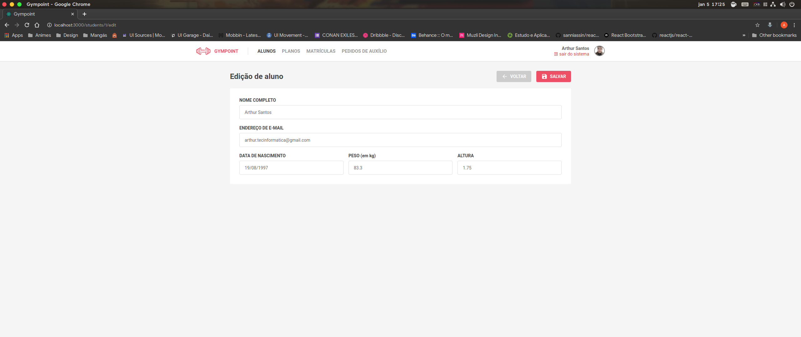
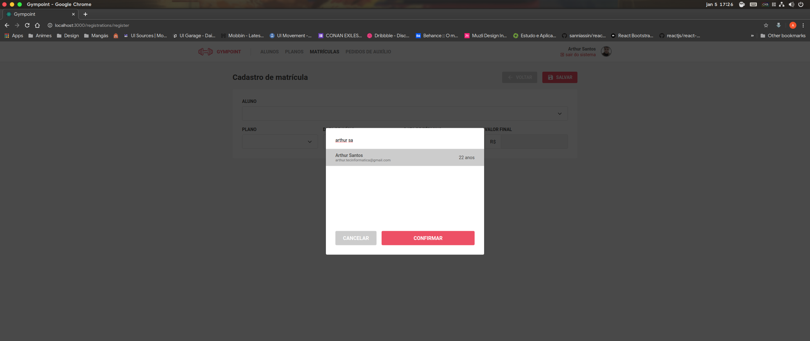
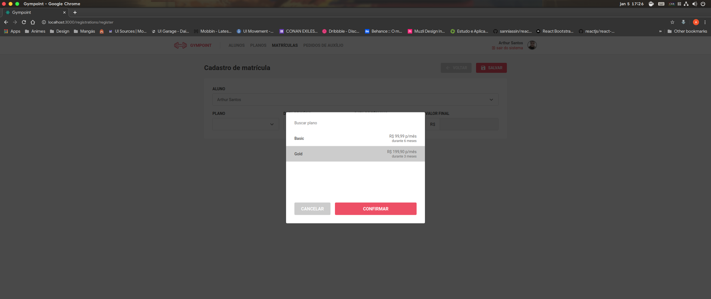
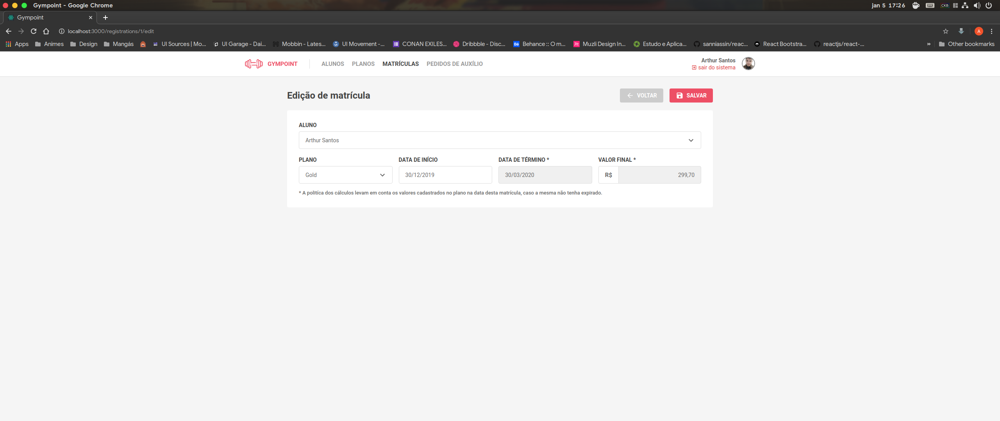
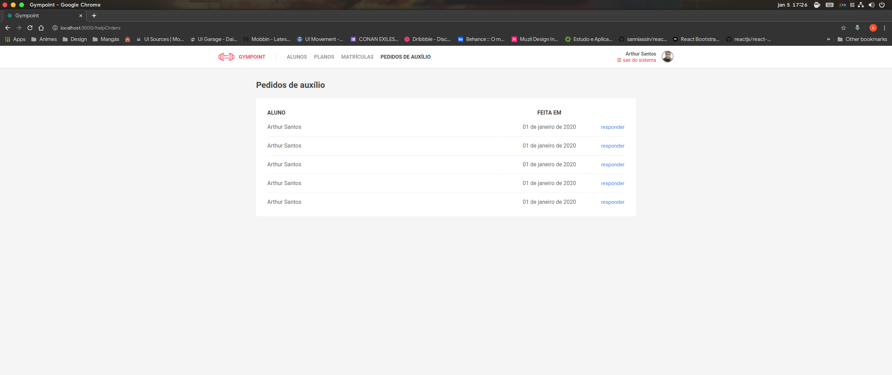
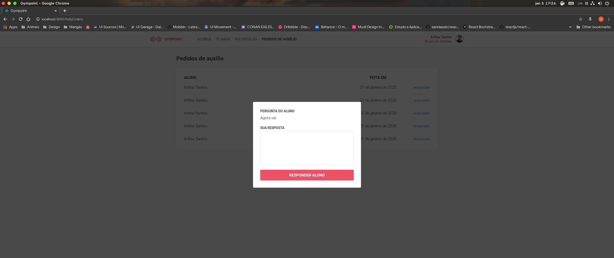
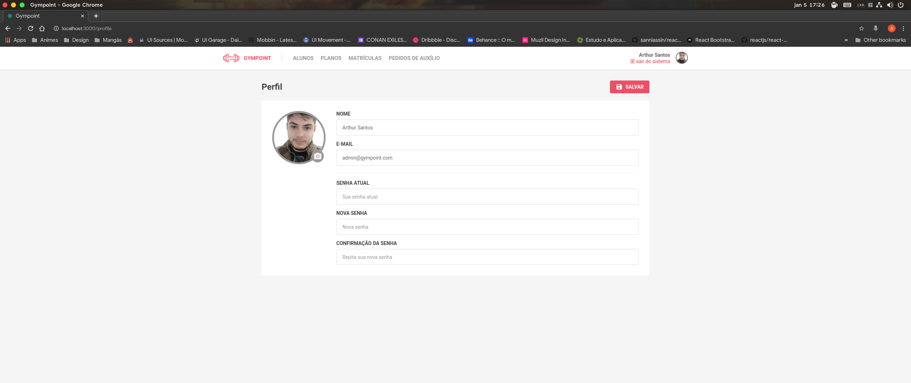

## Getting started

### Starting the server

You need a working [redis](https://redis.io/) server, if you are using the docker, you can get it by running this command:

`docker run --name redis -p 27017:{some_post} -d redis:alpine`

and, you need a working [postgres](https://www.postgresql.org/) server, again, if you are using the docker, you can get it by running this command:

`docker run --name postgres -e POSTGRES_PASSWORD={same_password} -p 5432:{some_post} postgres:11`

after this your can execute:

`cd server`

after

`yarn` or `npm install`

and create a .env file in root folder, copy the content of [.env.example](.env.example) from him and replace all required variables based on your system

and after

`yarn sequelize db:migrate && yarn sequelize db:seed:all` or use npm from this

and after

`yarn start` or `npm run start`

You can read more about server in this [README.md](/server/README.md)

### Starting the web application

You need execute all server commands and leave an instance of it running

After this your can execute

`cd web`

after

`yarn` or `npm install`

and after

`yarn start` or `npm run start`

You can read more about server in this [README.md](/web/README.md)

### Starting the mobile application

For the mobile app, currently only tests on your android version have been performed, so give preference to run on it, if you want to test on ios, test at your own risk

You need execute all server commands and leave an instance of it running

After this your can execute

`cd mobile`

after

`yarn` or `npm install`

Open [this file](mobile/src/services/api.js) and change the `YOUR_API_URL` with your api url and port

and after

`yarn start` or `npm run start`

and in another terminal

`yarn android` or `npm run android` or `yarn ios` or `npm run ios`

\* you can add a `--reset-cache` after flag `start` if you feel the need

You can read more about server in this [README.md](/mobile/README.md)
